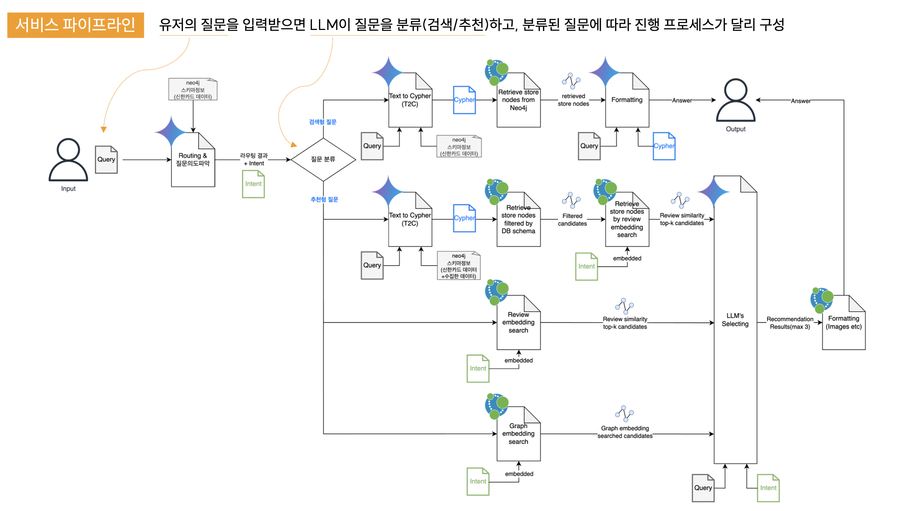

# bigcontest2024

> python 3.10 이상

빅콘테스트 2024 생성형 AI 분야 대상(과학기술정보통신부 장관상) 수상작입니다.

주제는 'LLM활용 제주도 맛집 추천 대화형 AI서비스 개발'입니다.

데모 영상 : https://drive.google.com/file/d/1djLocGtKmpJpuCyxZjOIDgiOfXnb3kdo/view

발표 자료 : https://drive.google.com/file/d/1-m3aU0PjJ5X7BsHo-WszG2m0VzqeocyC/view

### 실행 방법
💡 레포지토리 최상단 경로에 ```.env``` 파일이 존재해야합니다. 
```
pip install -r requirements.txt
```
```
streamlit run app.py
```


## DB SCHEMA


## Pipeline


## Data Load
### 네이버, 카카오, 구글 플랫폼 별로

1. 사진(URL)
2. 리뷰 데이터(100개 미만)
  - 네이버 - 방문자리뷰(개수)
  - 카카오맵 - 후기(개수)
  - 구글 - 개수
3. 별점 정보

### + 추가적인 정보 활용

- 네이버
영업시간,
메뉴별 가격,
리뷰 추천순으로 100개 미만 -> (데이트 / 연인,배우자) 연결해서 크롤링

- 카카오맵
시설정보

## 검색형 질문 - 쿼리 기준
- 특정 연월 - 포함시 : 해당 연월 기준
- 특정 연월 - 미포함시
  - 수치형 변수 : 연월 "평균값" 기준 (avg) 
  - 범주형 변수 : 연월 "마지막 값" 기준 (collect)

